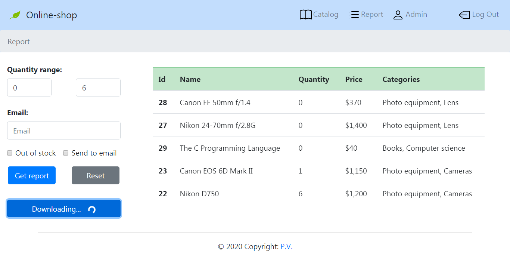

<h2>Technologies stack</h2>

<h4>Backend</h4>
<ul>
    <li>Spring Boot</li>
    <li>Spring Security</li>
    <li>доступ к данным: Hibernate, Spring Data JPA</li>
    <li>Jackson</li>
    <li>тесты: Spring Test, JUnit, Hamcrest, JSONPath</li>
    <li>MySQL</li>
    <li>Maven</li>
</ul>

<h4>Frontend</h4>

<ul>
    <li>React</li>
    <li>React Hooks</li>
    <li>Redux</li>
    <li>Bootstrap</li>
    <li>тесты: Jest, Enzyme</li>
</ul>

<h2>Функционал интернет-магазина</h2>

Общий функцианал приложения подробно описан в файлах:

<ul>
    <li>Terms of reference for server part.docx - backend часть</li>
    <li>Terms of reference for client part.docx - сторона пользовательского интерфейса</li>
</ul>

В дополнение к общему функционалу приложения, реализована возможность 
получения на указанный администратором e-mail адрес, html письма, обрабатываемым шаблонизатором 
Thymeleaf, с вложением отчета в формате excel об остатках товара на складе. Имеется функция
скачивания отчета.

Также функционал клиентской стороны дополнен возможностью отображения сообщений об 
ошибках ввода пользователя при заполнении форм и возможностью обработки статуса ответа сервера
с отображением соответствующего сообщения компонентом <code>PopUp</code>.

<h2>Модель базы данных</h2>

Структура базы данных приложения сформирована из 11 связанных таблиц, отображаемых 
средствами Hibernate в 8 классах.

Доступ к данным реализован с помощью Spring Data JPA. Слой доступа к данным представлен интерфейсами,
расширяющими CrudRepository и JpaRepository.

<h2>Аутентификация</h2>

Аутентификация в приложении выполняется на основе токена с помощью базы данных. Для этого функционал Spring Security
расширен следующими классами:

<ul>
    <li><code>Person</code> реализует интерфейс <code>UserDetails</code> и описывает пользователя, информация о котором
    инуапсулируется в <code>Authentication</code> объект</li>
    <li><code>PersonService</code> реализует интерфейс <code>UserDetailsService</code> и обрабатывает событие 
    успешной аутентификации пользователя</li>
</ul>

Токен и пароль пользователя сохраняются в БД в зашифрованным с помощью класса <code>BCryptPasswordEncoder</code> 
виде.
 
Конфигурация фреймворка Spring Security реализуется классом <code>WebSecurityConfig</code>, который расширяет
<code>WebSecurityConfigurerAdapter</code>. В указанном выше классе определеяется способ функционирования веб-службы
Rest - без сохранения состояния. Для этого в метод <code>sessionCreationPolicy()</code> передается значение 
<code>SessionCreationPolicy.STATELESS</code>. Такой подход позволяет повысить производительность веб-службы Rest.
  
Также в классе конфигурации регистрируется bean фильтра <code>CustomFilter</code>, расширяющего класс 
<code>OncePerRequestFilter</code>. Данный фильтр применяется один раз, до того как запрос будет направлен
 сервлету, что позволяет реализовать в нем функцию аутентификации пользователя.

<h2>Фильтрация, сортировка и пагинация</h2>

Приложение обеспечивает возможность просматривать ресурсы удобным для пользователя способом.

Администратор может получить сведения об истории покупок по отдельным категориям товаров или 
списку категорий, по товару или списку товаров, по клиентам, за определенный промежуток времени.
Например, запрос с параметрами следующего вида:
 
/purchases/?product=6,7,8&offset=6&limit=25&order=desc&sort=count&time=7
 
позволяет получить список покупок товаров с идентификаторами 6, 7, 8 за последние семь суток, начиная с шестой записи, 
с количеством записей равным 25, с сортировкой по убыванию количества проданных единиц.

Операции сортировки, фильтрации и пагинации результатов выборки рализованы в классах, расположенных в пакете 
<code>net.thumbtack.onlineshop.sorting</code>. Данные классы сочетают в себе методы динамического изменения значений 
опций сортировки и пагинации (класс <code>Sorter</code>), а также методы формирования запроса к базе данных 
(класс <code>CustomPageRequest</code>).

Класс <code>CustomPageRequest</code> реализует интерфейс <code>Pageable</code> (Spring Data) и обеспечивает 
возможность формирования запроса к БД с указанием параметров limit и offset для требуемого результата выборки.

<h2>Обработка исключений</h2>

В приложении реализована централизованная обработка исключений классом
<code>net.thumbtack.onlineshop.exception.GlobalExceptionHandler</code>, который снабжен аннотацией 
<code>@RestControllerAdvice</code>, предоставленной Spring Framework.

Такой подход позволяет исключить использование блоков try-catch в методах контроллеров, а использование 
исключений, расширяющих класс <code>RuntimeException</code>, позволяет избежать 
явного объявления проброса исключения

<h2>User interface</h2>

<h4>Login page</h4>

<h4>Catalog page</h4>

Products filter

<h4>Account page</h4>

Errors handling on account page

<h4>Product page</h4>

<h4>Cart page</h4>

Checkout

<h4>Report page</h4>

Email letter with report in excel file

<h4>Exception handling</h4>

